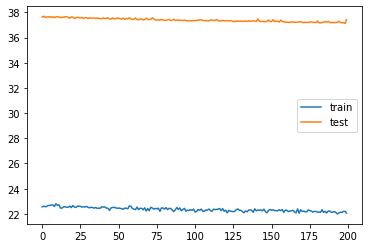

## Start by understand LSTMs
[LSTM](https://colah.github.io/posts/2015-08-Understanding-LSTMs/)

[Same in PDF format](https://filedn.com/lK1VhM9GbBxVlERr9KFjD4B/deep_learning_resources/timeseries/Understanding_LSTMs.pdf)

[Connection to OOP](https://www.kdnuggets.com/2019/08/simple-mix-object-oriented-programming-sharpen-deep-learning-prototype.html)

## Count Regression Problem

### Problem Setup
The data includes weekly occurrence counts of 11 keywords related to a disease
in an online discussion forum. The goal is to predict the official weekly disease
counts. The name of the disease and keywords are not relevant, thus are not
given.
The data is divided into training and test sets.
Training set has 282 rows (weeks), 13 columns. First column is the date of the
start of that particular week, next 11 columns are the keyword counts during
that week and the last column is the target which is the official weekly count of
number of people having that disease in that week.
The test set (52 rows) structure is the same, except that it does not have the
last column, i.e., target values.

#### TASK
The task is to create a machine learning model, trained on the training set, to
predict the weekly disease counts on the test set.

### Poisson Regression ?
The question is whether the logarithm of the weekly disease counts can be modeled as a linear combination of the weekly keyword counts.
It is unnatural to assume that the logarithm one count variable could be modeled as a linear combination of other counts, thus Poisson Regression is not the approach to take here.

### Black-Box Approach with Uncertainty Estimate ?
Nevertheless, the black-box model should always be possible to be implemented due to the universal approximation theorem.

We are going to use LSTM Neural network with MSE error. We could also consider turning this into a classification problem, but we would probably need at least 17 classes, thus not recommended.

To simulate the Bayesian approach :
The fact of randomly turning neurons on and off is roughly equivalent to performing a sampling of a Bernoulli distribution, and therefore “simulates” the mechanics of a Bayesian Neural Network (where weights are distributions, and not single values). Applying dropout is a bit like if we were “sampling” from the network. And if we repeat this process several times during inference, we will get different predictions with which we can estimate a distribution and eventually, uncertainty !

This paper is inspired by the Monte Carlo dropout (MC dropout) framework proposed in [13] and [22], which
requires no change of the existing model architecture and provides uncertainty estimation almost for free. Specifically, stochastic dropouts are applied after each hidden layer, and the model output can be approximately viewed as a random sample generated from the posterior predictive distribution
[21]. As a result, the model uncertainty can be estimated by the sample variance of the model predictions in a few
repetitions.

## Getting Data, Preprocessing and Generating Features


```
#!pip install --upgrade tensorflow --user
!pip install --upgrade numpy  --user
```


```
os.chdir("/media/sf_dl_projects_combined/ml_for_python_2019_/4_revision_python_programming/pytorch_problem")

train_path = os.path.abspath(
    os.path.join(
        "data",
        'training_set.csv'
    )
)

test_path = os.path.abspath(
    os.path.join(  
        "data",
        'test_set.csv'
    )
)

raw_train = pd.read_csv(train_path,delimiter=";",header=None)
raw_test = pd.read_csv(test_path,delimiter=";",header=None)

data_dict_features = {"trainX":raw_train.loc[:,:raw_train.shape[1]-2],"testX":raw_test}

```

### Train and Test Set have to have the same amount of Features


```
# So we have 12 feaures of counts (one corresponds to datetime)
#data_dict_features.get("testX").head()
print((raw_train.loc[:,:raw_train.shape[1]-2]).shape) 
print(raw_test.shape)
```

    (282, 12)
    (52, 12)


```
# havent used yet
def generate_data_units(data,nolabel):
    if nolabel == False:
        print(data.shape[1])
        X = data.loc[:,1:data.shape[1]-2]
        print(f"Amount of train features {X.shape[1]}")
        y = data.loc[:,data.shape[1]-1]
    else :
        y = []
        X = data.loc[:,1:data.shape[1]-1]
        print(f"Amount of test features {X.shape[1]}")
    return X,y,no_features

#trainX,trainy,no_features = generate_data_units(data=train,nolabel=False)
#testX,_,__ = generate_data_units(data=test,nolabel=True)
#no_features
```

### Setting Datetime as Index 


```
import os
import numpy as np
from numpy import genfromtxt
import pandas as pd

kwargs = {"n_in":10,"n_out":5,"dropnan":False,"col": 0}

################## TRANSFORM TRAIN AND TEST TOGETHER USING THIS #########3
def apply_fun(dict_:dict,fun,**kwargs):
    transformed_dict = dict((k, fun(v,**kwargs)) for k, v in dict_.items())
    return transformed_dict

def properly_set_time_idx(data:pd.DataFrame,**kwargs):
    s = data.set_index(pd.DatetimeIndex(data.loc[:,kwargs.get("col")]),inplace=False)
    if 0 in s.columns:
        s.drop([0],axis=1,inplace=True)
    return s

generated_features = apply_fun(data_dict_features,fun=properly_set_time_idx,**kwargs)

```

### Generate Time Series Features by Rolling (Shifting)


```
def generate_ts_features(data : pd.DataFrame, **kwargs ):
    """
    Frame a time series as a supervised learning dataset.
    Arguments:
        data: Sequence of observations as a list or NumPy array.
        n_in: Number of lag observations as input (X).
        n_out: Number of observations as output (y).
        dropnan: Boolean whether or not to drop rows with NaN values.
    Returns:
        Pandas DataFrame of series framed for supervised learning.
    """
    n_in= kwargs.get("n_in")
    n_out= kwargs.get("n_out")
    dropnan= kwargs.get("dropnan")
    n_vars = 1 if type(data) is list else data.shape[1]
    df = data.values
    cols, names = list(), list()
    
    # input sequence (t-n, ... t-1)
    
    for i in range(n_in, 0, -1):
        cols.append(pd.DataFrame(np.roll(df,i,axis=0)))
        names += [('var%d(t-%d)' % (j+1, i)) for j in range(n_vars)]
        
    # forecast sequence (t, t+1, ... t+n)
    for i in range(0, n_out):
        cols.append(pd.DataFrame(np.roll(df,-i,axis=0)))
        if i == 0:
            names += [('var%d(t)' % (j+1)) for j in range(n_vars)]
        else:
            names += [('var%d(t+%d)' % (j+1, i)) for j in range(n_vars)]
    # put it all together

    agg = pd.concat(cols, axis=1)
    agg.columns = names
    
    # drop rows with NaN values
    if dropnan:
        agg.dropna(inplace=True)
        
    return agg

generated_features_numpy_roll = apply_fun(generated_features,fun=generate_ts_features,**kwargs)
generated_features_numpy_roll["trainy"] = raw_train.loc[:,raw_train.shape[1]-1]

```


```
apply_fun(generated_features_numpy_roll,fun=lambda x : x.shape)
```


    {'trainX': (282, 165), 'testX': (52, 165), 'trainy': (282,)}


As you see from below, time series delay features have been generated. Now the neural network can used both the original time series as well as all possibly delayed versions of it.


```
apply_fun(generated_features_numpy_roll,fun=pd.DataFrame.head)
```


    {'trainX':    var1(t-10)  var2(t-10)  var3(t-10)  var4(t-10)  var5(t-10)  var6(t-10)  \
     0         4.0         1.0         2.0         2.0        20.0         0.0   
     1        14.0         1.0         2.0         2.0        25.0         1.0   
     2         5.0         1.0         6.0         4.0        24.0         1.0   
     3         6.0         0.0         0.0         0.0        17.0         0.0   
     4         5.0         3.0         2.0         1.0        16.0         0.0   
     
        var7(t-10)  var8(t-10)  var9(t-10)  var10(t-10)  ...  var3(t+4)  var4(t+4)  \
     0         1.0         2.0        17.0          1.0  ...        3.0        5.0   
     1         0.0         9.0        23.0          4.0  ...        8.0        7.0   
     2         0.0         5.0        13.0         12.0  ...        7.0        9.0   
     3         0.0         5.0        10.0          5.0  ...       12.0        3.0   
     4         0.0         7.0        18.0          5.0  ...        3.0        6.0   
     
        var5(t+4)  var6(t+4)  var7(t+4)  var8(t+4)  var9(t+4)  var10(t+4)  \
     0       58.0        0.0        0.0       28.0       41.0         5.0   
     1       61.0        2.0        0.0       17.0       38.0         7.0   
     2       55.0        3.0        0.0       21.0       31.0         4.0   
     3       57.0        0.0        0.0       29.0       34.0         7.0   
     4       35.0        1.0        0.0       21.0       34.0         7.0   
     
        var11(t+4)  var12(t+4)  
     0        27.0        51.0  
     1        16.0        65.0  
     2        14.0        37.0  
     3        26.0        35.0  
     4        10.0        22.0  
     
     [5 rows x 180 columns],
     'testX':    var1(t-10)  var2(t-10)  var3(t-10)  var4(t-10)  var5(t-10)  var6(t-10)  \
     0         8.0         0.0         2.0         3.0        11.0         1.0   
     1         7.0         1.0         0.0         3.0        11.0         0.0   
     2        10.0         1.0         1.0         3.0         6.0         0.0   
     3         1.0         1.0         2.0         1.0         7.0         0.0   
     4         7.0         0.0         1.0         0.0         6.0         0.0   
     
        var7(t-10)  var8(t-10)  var9(t-10)  var10(t-10)  ...  var2(t+4)  var3(t+4)  \
     0         0.0         6.0        12.0          5.0  ...        4.0        0.0   
     1         0.0         7.0        14.0          3.0  ...        0.0        2.0   
     2         0.0         3.0         5.0          5.0  ...        3.0        1.0   
     3         0.0         2.0        11.0          1.0  ...        1.0        0.0   
     4         0.0         3.0         8.0          7.0  ...        1.0        0.0   
     
        var4(t+4)  var5(t+4)  var6(t+4)  var7(t+4)  var8(t+4)  var9(t+4)  \
     0        1.0       13.0        0.0        0.0        3.0       12.0   
     1        0.0       10.0        0.0        0.0        3.0       19.0   
     2        1.0        8.0        0.0        1.0        5.0       15.0   
     3        1.0       15.0        0.0        0.0        4.0       17.0   
     4        0.0       13.0        1.0        1.0        4.0        9.0   
     
        var10(t+4)  var11(t+4)  
     0         5.0         7.0  
     1         7.0         2.0  
     2         3.0         3.0  
     3         2.0         3.0  
     4         0.0         2.0  
     
     [5 rows x 165 columns],
     'trainy': 0     9
     1    15
     2    20
     3    51
     4    51
     Name: 12, dtype: int64}


### Splitting the Data for Evaluation ; Reshaping for Input to LSTM


```
from sklearn.model_selection import train_test_split
X,y  = generated_features_numpy_roll.get("trainX").values, generated_features_numpy_roll.get("trainy").values
X_test = generated_features_numpy_roll.get("testX").values                                                
X_train, X_validate, y_train, y_validate = train_test_split(X, y, test_size=0.33, random_state=42)

### Reshaping to conform to LSTM 
# reshape input to be 3D [samples, timesteps, features]
n_in = kwargs.get("n_in")
n_out = kwargs.get("n_out")

X_train = X_train.reshape((X_train.shape[0],n_in + n_out , -1))
X_validate = X_validate.reshape((X_validate.shape[0], n_in + n_out, -1)) # X_validate.shape[1]
X_test = X_test.reshape((X_test.shape[0], n_in + n_out, -1)) # X_validate.shape[1]


print(X_train.shape, y_train.shape, X_validate.shape, y_validate.shape,X_test.shape)


```

    (188, 15, 11) (188,) (94, 15, 11) (94,) (52, 15, 11)


##  Simple LSTM Approach with Keras


```
import tensorflow as tf
from tensorflow import keras
from tensorflow.keras.models import Sequential
from tensorflow.keras.layers import Dense, LSTM
from tensorflow.keras.layers import Dropout
from tensorflow.keras.optimizers import SGD


kwargs_training = {"momentum":0.8,"decay":0.1,"lr":0.01,"lstm_units":80,\
                   "optimizer":"sgd","dropout_probability":0.2,"loss_":"mae"}
def model_string(**kwargs):
    return ', '.join('%s=%r' % x for x in kwargs.items())

def create_model(**kwargs):
    loss_ = kwargs.get("loss_")
    optimizer_ = kwargs.get("optimizer")
    if optimizer_ == "sgd":
          decay,momentum,lr = kwargs.get("decay"), kwargs.get("momentum"),kwargs.get("lr")
    dropout_probability = kwargs.get("dropout_probability")
    lstm_units = kwargs.get("lstm_units")
    model = tf.keras.Sequential()
    sgd = SGD(lr=lr, momentum=momentum, decay=decay, nesterov=False)
  
    model.add(LSTM(lstm_units, input_shape=(X_train.shape[1], X_train.shape[2]))) # LSTM input is timesteps x features
    # https://machinelearningmastery.com/dropout-regularization-deep-learning-models-keras/
    model.add(Dropout(dropout_probability))
    model.add(Dense(1)) # predicting one dependent variable
    model.compile(loss=loss_,optimizer = optimizer_ ) #  or optimizer='adam'
   
    modelstring = model_string(**kwargs)
    return model,modelstring

```

### Model 1


```

# FITTING #
epochs1 = 200
model,modelstring = create_model(**kwargs_training)
history1 = model.fit(X_train, y_train, epochs=epochs1, batch_size=30, \
                    validation_data=(X_validate, y_validate), verbose=2, shuffle=False)

model.save(f"models/{modelstring}_model.h5")  # creates a HDF5 file 
model.save_weights(f"models/{modelstring}_model_weights.h5")  # creates a HDF5 file 'my_model.h5'

%matplotlib inline
import matplotlib.pyplot as plt
plt.plot(history1.history['loss'], label='train')
plt.plot(history1.history['val_loss'], label='test')
plt.legend()


```

    Train on 188 samples, validate on 94 samples
    Epoch 1/200
    188/188 - 3s - loss: 27.8968 - val_loss: 41.9293
    Epoch 2/200
    188/188 - 0s - loss: 26.2010 - val_loss: 40.9348
    Epoch 3/200
    188/188 - 0s - loss: 25.5944 - val_loss: 40.4223
    Epoch 4/200
    188/188 - 1s - loss: 25.3523 - val_loss: 40.1713
    Epoch 5/200
    188/188 - 0s - loss: 25.2422 - val_loss: 40.0027
    Epoch 6/200
    188/188 - 0s - loss: 25.1746 - val_loss: 39.9293
    Epoch 7/200
    188/188 - 0s - loss: 25.1588 - val_loss: 39.8007
    Epoch 8/200
    188/188 - 1s - loss: 25.0664 - val_loss: 39.8054
    Epoch 9/200
    188/188 - 1s - loss: 24.9841 - val_loss: 39.7287
    Epoch 10/200
    188/188 - 0s - loss: 24.9334 - val_loss: 39.6160
    Epoch 11/200
    188/188 - 1s - loss: 24.8593 - val_loss: 39.7895
    Epoch 12/200
    188/188 - 0s - loss: 24.9153 - val_loss: 40.1319
    Epoch 13/200
    188/188 - 1s - loss: 24.8637 - val_loss: 39.8150
    Epoch 14/200
    188/188 - 0s - loss: 24.8786 - val_loss: 39.5098
    Epoch 15/200
    188/188 - 0s - loss: 24.8065 - val_loss: 39.4745
    Epoch 16/200
    188/188 - 1s - loss: 24.7559 - val_loss: 39.5356
    Epoch 17/200
    188/188 - 0s - loss: 24.6838 - val_loss: 39.6299
    Epoch 18/200
    188/188 - 0s - loss: 24.3628 - val_loss: 39.5610
    Epoch 19/200
    188/188 - 0s - loss: 24.6665 - val_loss: 39.2129
    Epoch 20/200
    188/188 - 0s - loss: 24.2880 - val_loss: 39.0383
    Epoch 21/200
    188/188 - 0s - loss: 24.3788 - val_loss: 39.2292
    Epoch 22/200
    188/188 - 0s - loss: 24.3158 - val_loss: 39.3000
    Epoch 23/200
    188/188 - 0s - loss: 24.1698 - val_loss: 39.5333
    Epoch 24/200
    188/188 - 0s - loss: 24.2518 - val_loss: 39.3642
    Epoch 25/200
    188/188 - 0s - loss: 24.1262 - val_loss: 39.0379
    Epoch 26/200
    188/188 - 0s - loss: 23.9498 - val_loss: 38.7957
    Epoch 27/200
    188/188 - 0s - loss: 24.0975 - val_loss: 39.0883
    Epoch 28/200
    188/188 - 0s - loss: 23.8215 - val_loss: 39.0445
    Epoch 29/200
    188/188 - 0s - loss: 23.7738 - val_loss: 39.0293
    Epoch 30/200
    188/188 - 1s - loss: 23.8636 - val_loss: 39.2492
    Epoch 31/200
    188/188 - 0s - loss: 24.1944 - val_loss: 39.0617
    Epoch 32/200
    188/188 - 0s - loss: 23.9506 - val_loss: 39.0279
    Epoch 33/200
    188/188 - 0s - loss: 23.9468 - val_loss: 38.9213
    Epoch 34/200
    188/188 - 1s - loss: 23.9629 - val_loss: 38.8874
    Epoch 35/200
    188/188 - 0s - loss: 23.9463 - val_loss: 38.8931
    Epoch 36/200
    188/188 - 1s - loss: 23.7750 - val_loss: 39.2705
    Epoch 37/200
    188/188 - 0s - loss: 23.9062 - val_loss: 38.8267
    Epoch 38/200
    188/188 - 0s - loss: 23.6153 - val_loss: 38.6370
    Epoch 39/200
    188/188 - 1s - loss: 23.8698 - val_loss: 38.8858
    Epoch 40/200
    188/188 - 0s - loss: 23.6120 - val_loss: 38.9540
    Epoch 41/200
    188/188 - 0s - loss: 23.7894 - val_loss: 38.5709
    Epoch 42/200
    188/188 - 0s - loss: 23.6328 - val_loss: 38.7202
    Epoch 43/200
    188/188 - 0s - loss: 23.3432 - val_loss: 38.5224
    Epoch 44/200
    188/188 - 0s - loss: 23.3823 - val_loss: 38.3770
    Epoch 45/200
    188/188 - 0s - loss: 23.7614 - val_loss: 38.4877
    Epoch 46/200
    188/188 - 0s - loss: 23.5285 - val_loss: 38.7085
    Epoch 47/200
    188/188 - 0s - loss: 23.1390 - val_loss: 38.6758
    Epoch 48/200
    188/188 - 0s - loss: 23.3354 - val_loss: 38.4384
    Epoch 49/200
    188/188 - 0s - loss: 23.1121 - val_loss: 38.7833
    Epoch 50/200
    188/188 - 0s - loss: 23.4775 - val_loss: 38.5510
    Epoch 51/200
    188/188 - 0s - loss: 23.5512 - val_loss: 38.8906
    Epoch 52/200
    188/188 - 0s - loss: 23.4522 - val_loss: 38.6099
    Epoch 53/200
    188/188 - 0s - loss: 23.3069 - val_loss: 38.9721
    Epoch 54/200
    188/188 - 0s - loss: 23.4424 - val_loss: 38.4622
    Epoch 55/200
    188/188 - 0s - loss: 23.1174 - val_loss: 38.4554
    Epoch 56/200
    188/188 - 0s - loss: 23.2976 - val_loss: 38.5414
    Epoch 57/200
    188/188 - 0s - loss: 23.1200 - val_loss: 38.3669
    Epoch 58/200
    188/188 - 0s - loss: 23.1684 - val_loss: 38.3410
    Epoch 59/200
    188/188 - 0s - loss: 23.2140 - val_loss: 38.5724
    Epoch 60/200
    188/188 - 1s - loss: 23.1537 - val_loss: 38.5185
    Epoch 61/200
    188/188 - 0s - loss: 23.2080 - val_loss: 38.2615
    Epoch 62/200
    188/188 - 0s - loss: 23.4899 - val_loss: 38.0609
    Epoch 63/200
    188/188 - 1s - loss: 23.3854 - val_loss: 38.4194
    Epoch 64/200
    188/188 - 0s - loss: 23.1700 - val_loss: 38.5043
    Epoch 65/200
    188/188 - 0s - loss: 23.2208 - val_loss: 38.4389
    Epoch 66/200
    188/188 - 0s - loss: 23.0150 - val_loss: 38.3050
    Epoch 67/200
    188/188 - 1s - loss: 22.9379 - val_loss: 37.9818
    Epoch 68/200
    188/188 - 0s - loss: 22.7911 - val_loss: 38.1129
    Epoch 69/200
    188/188 - 0s - loss: 22.9225 - val_loss: 38.0429
    Epoch 70/200
    188/188 - 0s - loss: 23.2461 - val_loss: 38.4731
    Epoch 71/200
    188/188 - 0s - loss: 23.3134 - val_loss: 37.8365
    Epoch 72/200
    188/188 - 0s - loss: 22.6542 - val_loss: 38.7071
    Epoch 73/200
    188/188 - 0s - loss: 23.1958 - val_loss: 38.0235
    Epoch 74/200
    188/188 - 0s - loss: 22.7594 - val_loss: 37.9769
    Epoch 75/200
    188/188 - 1s - loss: 22.7646 - val_loss: 38.7169
    Epoch 76/200
    188/188 - 0s - loss: 22.8763 - val_loss: 38.3375
    Epoch 77/200
    188/188 - 1s - loss: 22.7177 - val_loss: 38.1373
    Epoch 78/200
    188/188 - 0s - loss: 22.8363 - val_loss: 37.8355
    Epoch 79/200
    188/188 - 1s - loss: 22.6248 - val_loss: 38.5495
    Epoch 80/200
    188/188 - 1s - loss: 22.8923 - val_loss: 37.6583
    Epoch 81/200
    188/188 - 0s - loss: 22.6396 - val_loss: 37.6736
    Epoch 82/200
    188/188 - 0s - loss: 22.6274 - val_loss: 37.7754
    Epoch 83/200
    188/188 - 0s - loss: 22.4425 - val_loss: 37.7748
    Epoch 84/200
    188/188 - 0s - loss: 22.5043 - val_loss: 37.9660
    Epoch 85/200
    188/188 - 0s - loss: 23.0874 - val_loss: 37.8547
    Epoch 86/200
    188/188 - 0s - loss: 22.6108 - val_loss: 37.7149
    Epoch 87/200
    188/188 - 0s - loss: 22.6060 - val_loss: 37.6846
    Epoch 88/200
    188/188 - 0s - loss: 22.3581 - val_loss: 37.5205
    Epoch 89/200
    188/188 - 0s - loss: 22.4750 - val_loss: 37.3987
    Epoch 90/200
    188/188 - 1s - loss: 22.0929 - val_loss: 37.5478
    Epoch 91/200
    188/188 - 0s - loss: 22.4912 - val_loss: 37.5268
    Epoch 92/200
    188/188 - 1s - loss: 22.4478 - val_loss: 37.6076
    Epoch 93/200
    188/188 - 0s - loss: 22.6622 - val_loss: 37.7702
    Epoch 94/200
    188/188 - 0s - loss: 22.1033 - val_loss: 38.0147
    Epoch 95/200
    188/188 - 0s - loss: 22.5005 - val_loss: 37.1612
    Epoch 96/200
    188/188 - 0s - loss: 22.3205 - val_loss: 38.0292
    Epoch 97/200
    188/188 - 0s - loss: 22.9741 - val_loss: 37.6225
    Epoch 98/200
    188/188 - 0s - loss: 22.3109 - val_loss: 37.3766
    Epoch 99/200
    188/188 - 0s - loss: 22.4480 - val_loss: 37.4781
    Epoch 100/200
    188/188 - 0s - loss: 22.0616 - val_loss: 37.7327
    Epoch 101/200
    188/188 - 0s - loss: 22.5241 - val_loss: 37.8670
    Epoch 102/200
    188/188 - 0s - loss: 22.7783 - val_loss: 37.5859
    Epoch 103/200
    188/188 - 1s - loss: 22.3943 - val_loss: 37.6278
    Epoch 104/200
    188/188 - 0s - loss: 22.2346 - val_loss: 37.6674
    Epoch 105/200
    188/188 - 1s - loss: 22.3890 - val_loss: 38.3074
    Epoch 106/200
    188/188 - 0s - loss: 23.1005 - val_loss: 37.8651
    Epoch 107/200
    188/188 - 0s - loss: 22.7588 - val_loss: 37.6786
    Epoch 108/200
    188/188 - 0s - loss: 22.5190 - val_loss: 37.7425
    Epoch 109/200
    188/188 - 0s - loss: 22.5479 - val_loss: 37.3026
    Epoch 110/200
    188/188 - 0s - loss: 22.1635 - val_loss: 37.8790
    Epoch 111/200
    188/188 - 1s - loss: 22.2813 - val_loss: 36.8880
    Epoch 112/200
    188/188 - 1s - loss: 22.3093 - val_loss: 37.5030
    Epoch 113/200
    188/188 - 0s - loss: 22.3690 - val_loss: 37.7640
    Epoch 114/200
    188/188 - 0s - loss: 22.6344 - val_loss: 37.2657
    Epoch 115/200
    188/188 - 0s - loss: 21.9072 - val_loss: 37.1368
    Epoch 116/200
    188/188 - 0s - loss: 22.2582 - val_loss: 37.2627
    Epoch 117/200
    188/188 - 0s - loss: 22.0054 - val_loss: 37.4039
    Epoch 118/200
    188/188 - 0s - loss: 22.3508 - val_loss: 37.7959
    Epoch 119/200
    188/188 - 0s - loss: 22.1599 - val_loss: 36.9922
    Epoch 120/200
    188/188 - 0s - loss: 22.0995 - val_loss: 37.1968
    Epoch 121/200
    188/188 - 0s - loss: 22.2894 - val_loss: 37.4728
    Epoch 122/200
    188/188 - 0s - loss: 22.0729 - val_loss: 36.9973
    Epoch 123/200
    188/188 - 1s - loss: 21.9272 - val_loss: 36.9546
    Epoch 124/200
    188/188 - 1s - loss: 21.8117 - val_loss: 37.3020
    Epoch 125/200
    188/188 - 0s - loss: 21.8197 - val_loss: 37.1387
    Epoch 126/200
    188/188 - 0s - loss: 21.7712 - val_loss: 36.4832
    Epoch 127/200
    188/188 - 0s - loss: 21.7288 - val_loss: 36.9088
    Epoch 128/200
    188/188 - 0s - loss: 21.7628 - val_loss: 37.3018
    Epoch 129/200
    188/188 - 0s - loss: 21.6223 - val_loss: 36.4398
    Epoch 130/200
    188/188 - 0s - loss: 21.3014 - val_loss: 36.9049
    Epoch 131/200
    188/188 - 0s - loss: 21.8838 - val_loss: 36.5232
    Epoch 132/200
    188/188 - 1s - loss: 21.5271 - val_loss: 36.5145
    Epoch 133/200
    188/188 - 1s - loss: 21.4557 - val_loss: 36.7753
    Epoch 134/200
    188/188 - 0s - loss: 21.7467 - val_loss: 37.0760
    Epoch 135/200
    188/188 - 0s - loss: 21.7166 - val_loss: 36.8293
    Epoch 136/200
    188/188 - 0s - loss: 21.6009 - val_loss: 36.5745
    Epoch 137/200
    188/188 - 1s - loss: 21.3160 - val_loss: 36.6040
    Epoch 138/200
    188/188 - 0s - loss: 21.5528 - val_loss: 36.5726
    Epoch 139/200
    188/188 - 1s - loss: 21.3435 - val_loss: 36.9936
    Epoch 140/200
    188/188 - 0s - loss: 21.2798 - val_loss: 37.8046
    Epoch 141/200
    188/188 - 0s - loss: 21.9226 - val_loss: 36.4779
    Epoch 142/200
    188/188 - 0s - loss: 21.5837 - val_loss: 36.7371
    Epoch 143/200
    188/188 - 1s - loss: 21.3331 - val_loss: 36.5396
    Epoch 144/200
    188/188 - 0s - loss: 21.4419 - val_loss: 36.5939
    Epoch 145/200
    188/188 - 1s - loss: 21.1287 - val_loss: 36.7319
    Epoch 146/200
    188/188 - 0s - loss: 21.4508 - val_loss: 36.7234
    Epoch 147/200
    188/188 - 0s - loss: 21.3530 - val_loss: 36.7118
    Epoch 148/200
    188/188 - 1s - loss: 21.1356 - val_loss: 36.7462
    Epoch 149/200
    188/188 - 0s - loss: 21.4840 - val_loss: 35.9579
    Epoch 150/200
    188/188 - 0s - loss: 21.2358 - val_loss: 36.4425
    Epoch 151/200
    188/188 - 1s - loss: 21.4080 - val_loss: 36.0240
    Epoch 152/200
    188/188 - 0s - loss: 21.0579 - val_loss: 36.4249
    Epoch 153/200
    188/188 - 0s - loss: 21.0955 - val_loss: 36.0049
    Epoch 154/200
    188/188 - 1s - loss: 21.3105 - val_loss: 35.8355
    Epoch 155/200
    188/188 - 0s - loss: 21.1544 - val_loss: 36.0769
    Epoch 156/200
    188/188 - 1s - loss: 21.3593 - val_loss: 36.5823
    Epoch 157/200
    188/188 - 0s - loss: 21.1918 - val_loss: 37.0106
    Epoch 158/200
    188/188 - 0s - loss: 21.7130 - val_loss: 36.5814
    Epoch 159/200
    188/188 - 1s - loss: 20.9758 - val_loss: 35.7327
    Epoch 160/200
    188/188 - 0s - loss: 21.1050 - val_loss: 36.0761
    Epoch 161/200
    188/188 - 0s - loss: 21.0658 - val_loss: 35.8640
    Epoch 162/200
    188/188 - 1s - loss: 21.0002 - val_loss: 36.1907
    Epoch 163/200
    188/188 - 0s - loss: 21.1297 - val_loss: 36.3619
    Epoch 164/200
    188/188 - 0s - loss: 20.9762 - val_loss: 35.5055
    Epoch 165/200
    188/188 - 0s - loss: 20.6919 - val_loss: 35.9504
    Epoch 166/200
    188/188 - 0s - loss: 20.7592 - val_loss: 35.4689
    Epoch 167/200
    188/188 - 0s - loss: 20.4417 - val_loss: 36.0728
    Epoch 168/200
    188/188 - 0s - loss: 21.3259 - val_loss: 35.6353
    Epoch 169/200
    188/188 - 0s - loss: 20.9047 - val_loss: 35.6295
    Epoch 170/200
    188/188 - 0s - loss: 20.8464 - val_loss: 35.5302
    Epoch 171/200
    188/188 - 0s - loss: 20.8162 - val_loss: 36.7509
    Epoch 172/200
    188/188 - 0s - loss: 20.8296 - val_loss: 36.0541
    Epoch 173/200
    188/188 - 0s - loss: 20.8282 - val_loss: 35.2248
    Epoch 174/200
    188/188 - 0s - loss: 20.6538 - val_loss: 35.3967
    Epoch 175/200
    188/188 - 1s - loss: 20.7099 - val_loss: 35.7486
    Epoch 176/200
    188/188 - 0s - loss: 21.1728 - val_loss: 35.3010
    Epoch 177/200
    188/188 - 0s - loss: 20.5090 - val_loss: 35.6913
    Epoch 178/200
    188/188 - 0s - loss: 20.6961 - val_loss: 35.7508
    Epoch 179/200
    188/188 - 0s - loss: 20.9069 - val_loss: 35.6286
    Epoch 180/200
    188/188 - 0s - loss: 20.4417 - val_loss: 35.9645
    Epoch 181/200
    188/188 - 0s - loss: 21.0049 - val_loss: 35.3220
    Epoch 182/200
    188/188 - 0s - loss: 20.5556 - val_loss: 34.8859
    Epoch 183/200
    188/188 - 0s - loss: 20.6552 - val_loss: 36.6003
    Epoch 184/200
    188/188 - 0s - loss: 21.3704 - val_loss: 35.4770
    Epoch 185/200
    188/188 - 0s - loss: 20.7995 - val_loss: 36.7102
    Epoch 186/200
    188/188 - 0s - loss: 20.6135 - val_loss: 35.1532
    Epoch 187/200
    188/188 - 0s - loss: 20.2564 - val_loss: 35.2863
    Epoch 188/200
    188/188 - 0s - loss: 20.6789 - val_loss: 36.9211
    Epoch 189/200
    188/188 - 1s - loss: 20.9764 - val_loss: 35.4951
    Epoch 190/200
    188/188 - 1s - loss: 20.6143 - val_loss: 36.1385
    Epoch 191/200
    188/188 - 0s - loss: 20.6171 - val_loss: 34.4918
    Epoch 192/200
    188/188 - 1s - loss: 20.1095 - val_loss: 35.6351
    Epoch 193/200
    188/188 - 0s - loss: 20.7958 - val_loss: 35.8846
    Epoch 194/200
    188/188 - 0s - loss: 21.3832 - val_loss: 35.3583
    Epoch 195/200
    188/188 - 0s - loss: 20.5275 - val_loss: 34.5942
    Epoch 196/200
    188/188 - 0s - loss: 20.6288 - val_loss: 35.0323
    Epoch 197/200
    188/188 - 0s - loss: 20.4071 - val_loss: 36.1474
    Epoch 198/200
    188/188 - 0s - loss: 20.6771 - val_loss: 34.6950
    Epoch 199/200
    188/188 - 0s - loss: 20.0845 - val_loss: 36.0922
    Epoch 200/200
    188/188 - 0s - loss: 21.1785 - val_loss: 34.9730
    The best validation with this LSTM model with 200 epochs was 34.97304392875509


```
print(f"The best validation with this LSTM model with {epochs_} epochs was {history1.history['val_loss'][-1]}")
```

### LSTM Model 2


```
kwargs_training2 = {"momentum":0.8,"decay":0.1,"lr":0.01,"lstm_units":80,\
                   "optimizer":"adam","dropout_probability":0.2,"loss_":"mae"}
model2,modelstring2 = create_model(**kwargs_training)
epochs_ = 200
#history = model.fit(X_train, y_train, epochs=epochs_, batch_size=30, \
#                    validation_data=(X_validate, y_validate), verbose=2, shuffle=False)

model2.save(f"{modelstring2}_model.h5")  # creates a HDF5 file 
model2.save_weights(f"{modelstring2}_model_weights.h5")  # creates a HDF5 file 'my_model.h5'
print(f"The best validation with this LSTM model with {epochs_} epochs was {history.history['val_loss'][-1]}")
```

    The best validation with this LSTM model with 200 epochs was 37.4167932145139


```
%matplotlib inline
import matplotlib.pyplot as plt
plt.plot(history.history['loss'], label='train')
plt.plot(history.history['val_loss'], label='test')
plt.legend()
```


    <matplotlib.legend.Legend at 0x7f88633f5a58>





### From the Graph we can clearly see the overfitting problem!

## Summary
### Since Model 1 did better, we will use that to get the Test Predictions


```
import tensorflow as tf
generated_features_numpy_roll.keys()
#generated_features_numpy_roll["test"] = generated_features_numpy_roll["test"].values.reshape((generated_features_numpy_roll["test"].shape[0], n_in + n_out, -1)) # X_validate.shape[1]

# Getting final predictions 
testpredictions = np.round(model.predict(X_test, verbose=0),0)

```


```
print(X_train.shape, y_train.shape, X_validate.shape, y_validate.shape,X_test.shape)
# X_train has shape [samples x timesteps x features]
```

    (188, 15, 11) (188,) (94, 15, 11) (94,) (52, 15, 11)


### To improve the model:
    - Generate more features
    - Generate synthetic data
    - Try more complex model

## Simple Encoder-Decoder LSTM Approach


```

```
